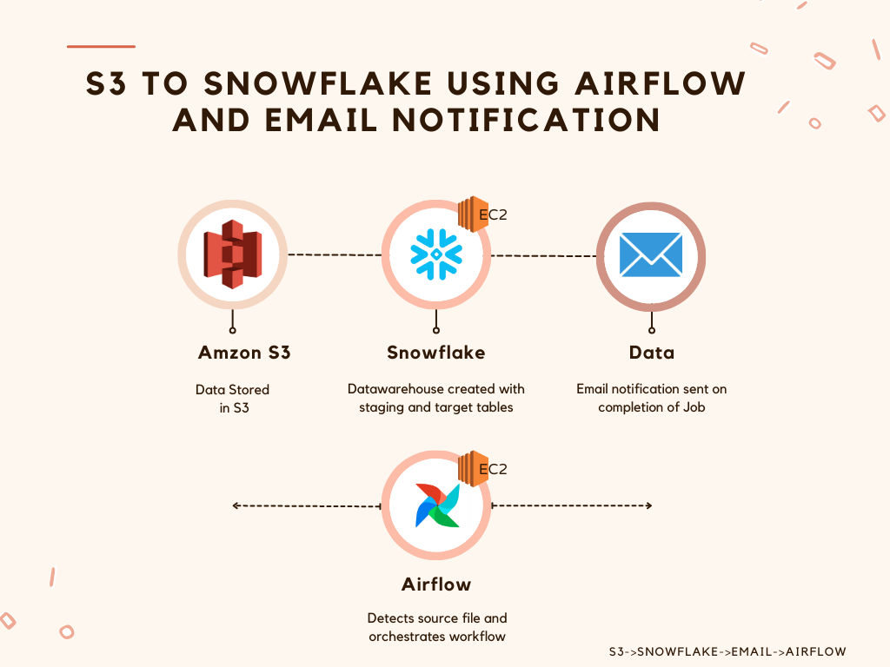
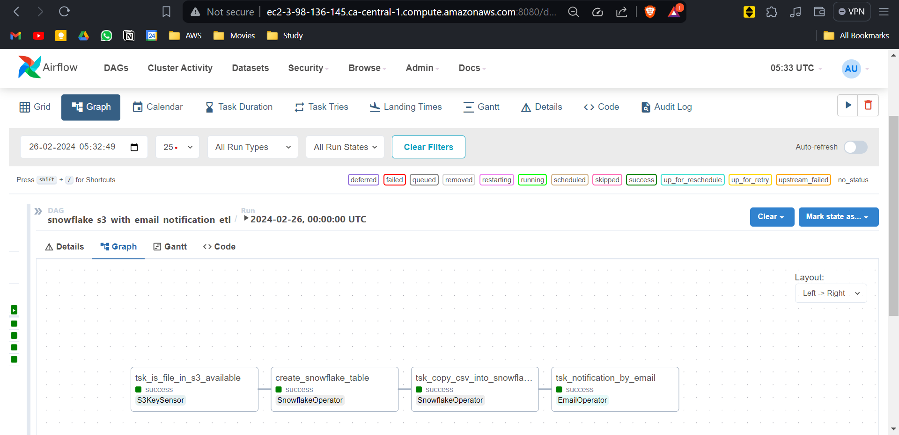
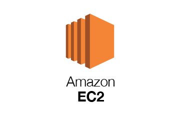

# Cloud-based Data Ingestion from S3 to Snowflake with Apache Airflow

## Overview

This project is hosted entirely in the cloud on an EC2 instance running Apache Airflow. Its primary objective is to efficiently ingest data from S3 to Snowflake while providing email notification upon successful job completion.

## Workflow

## Steps
1. **Data Storage in S3:**
   - Data is stored in S3, ready for ingestion.

2. **EC2 Instance Setup:**
   - An EC2 instance is created, and Apache Airflow is installed within a Python environment on the same instance.

3. **Warehouse Structure Creation:**
   - Execute the Snowflake Warehouse DDL script ([Snowflake Warehouse DDL.txt](Snowflake Warehouse DDL.txt)) to establish the required structure. This includes creating a Staging table connected to S3 and the Target table, *city_info*.

4. **ETL Job with PySpark:**
   - **ETL Job Name:** [airflow_snowflake_s3_email.py](airflow_snowflake_s3_email.py)
     - 4.1. Use S3 key sensor to detect any file uploaded to S3 every 3 seconds.
     - 4.2. Move the data from the staging table to the target table.
     - 4.3. Send an email notification after successful data ingestion.

## DAGs in Apache Airflow

## Output

## Hosted Machine

#### EC2
&nbsp; &nbsp; &nbsp; &nbsp; &nbsp; &nbsp;

## Language Used

Feel free to explore the provided links to delve deeper into specific components of the project!
